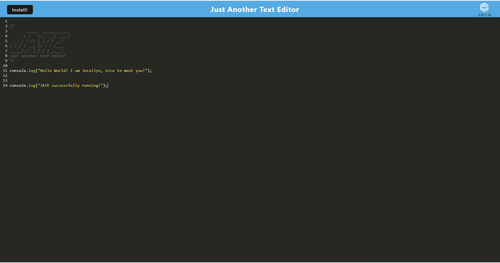

# PWA-jate

## Description
The app is a single-page application that meets the PWA criteria. The app features a number of data persistence techniques that serve as redundancy in case one of the options is not supported by the browser. The application can also function offline.

## Deployed Application

## JATE screenshot

## Installation
Ran npm i to install all dependencies in each folder, then npm run build to generate the dist folder in client's folder.

## Usage
Run command "npm run start:dev" to run the application, then open follow the link http:localhost:8080.